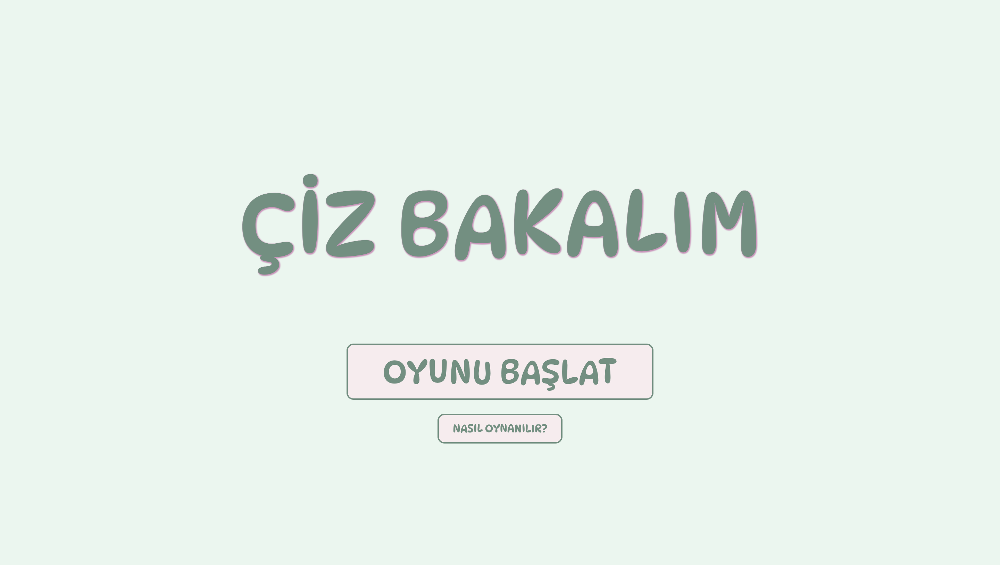
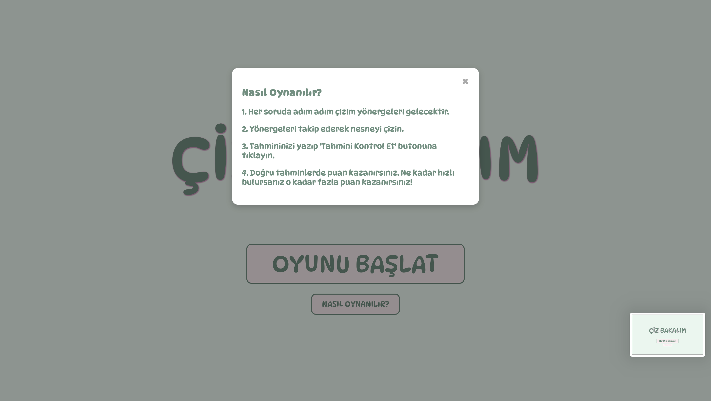
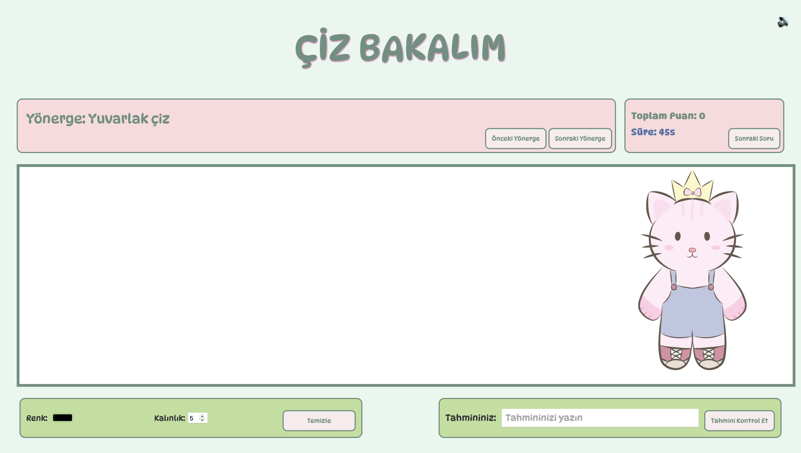
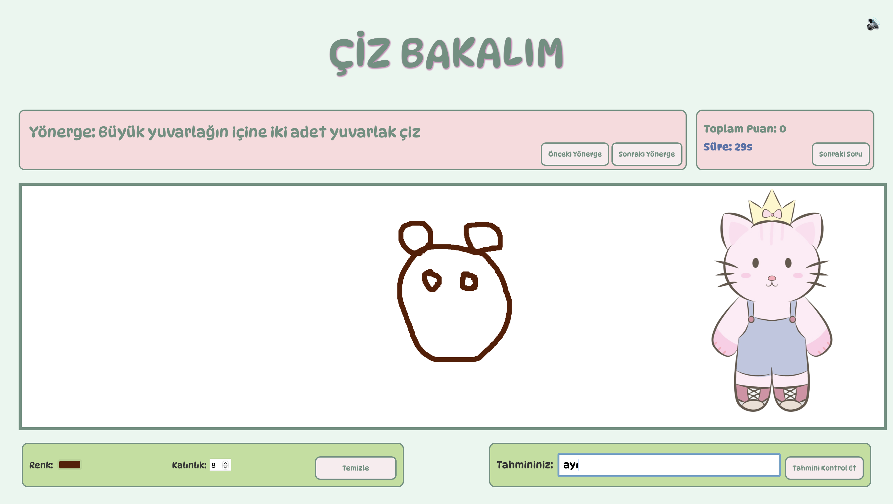

# Web Tabanlı Oyun Projesi: Çiz Bakalım

## Proje Hakkında

Bu proje, [Descriptionary](https://fingerclap.itch.io/descriptionary) oyunundan esinlenerek HTML5 ve JavaScript kullanılarak geliştirilmiş 2 boyutlu web tabanlı bir oyundur.  
Oyun, canvas elementi kullanılarak temel mekanikler yeniden kodlanmış ve kendi görsel tasarımlarımla zenginleştirilmiştir.

Descriptionary, özgün ve yaratıcı çizimlere dayalı bir tahmin oyunudur.
Çiz Bakalım oyununu [buradan](https://mlkyzgt.github.io/ciz_bakalim/) oynayabilirsiniz.

---

## Oyunun Amacı ve Kuralları

Oyuncunun amacı, adım adım verilen ipuçlarına göre doğru nesneyi çizmek ve çizilen nesneyi tahmin etmektir.  
Oyuncu fare ile çizim yapar ve çizim süresi sınırlıdır.  
Oyuncular tahminlerini klavye ile yapar.  
Puanlar tahminin süresine ve tahmin doğruluğuna göre verilir.

---

## Kullanılan Teknolojiler

- HTML5 Canvas  
- JavaScript
- CSS
- Oyun içi ses efektleri ve arka plan müziği

---

## Oyun Mekanikleri

- Canvas üzerinde dinamik çizim aracı  
- Çizim süresi ve tahmin süresi zamanlayıcıları  
- Fare ile çizim kontrolü  
- Puanlama sistemi  
- Basit animasyon ve efektler

---

## Ekran Görüntüleri

Oyunun farklı aşamalarından ekran görüntüleri aşağıdadır:

### Başlangıç Ekranı

### Nasıl Oynanır Sayfası

### Ana Menü

### Çizim Aşaması

---

## Projeye Dair Önemli Notlar

- Oyun, Chrome, Safari ve Firefox tarayıcılarında test edilmiştir ve sorunsuz çalışmaktadır.  
- Oyun geliştirilirken herhangi bir hazır JS oyun kütüphanesi kullanılmamıştır.  
- Kullanılan görseller ve ses dosyalarının linklerine buradan ulaşılabilir: [arka plan müziği](https://youtu.be/o5Csf-XrXdY?feature=shared) - [doğru/yanlış bildirim sesi](https://www.youtube.com/watch?v=worclOeTALw)
- Kodlar içerisinde Türkçe ve açıklayıcı yorumlar bulunmaktadır.  
- Oynanış videosu YouTube’da yayınlanmış olup, [buradan](https://youtu.be/403OLKLxyzs?si=WgPvTeIFk7DDmotg) izlenebilir.  

---

## Yapay Zeka Kullanımı

Bu projede yapay zeka araçları (ChatGPT vb.) kullanılarak oyun mekaniği tasarımı ve hata ayıklama süreçlerinde destek alınmıştır.  
Tüm kullanılan promptlar ve yapay zekadan alınan cevaplar “AI.md” dosyasında detaylı olarak bulunmaktadır.

---

## Seçilen Oyun

- İsim: Descriptionary  
- Link: [https://fingerclap.itch.io/descriptionary](https://fingerclap.itch.io/descriptionary)  
- Seçim sebebi: Oyun özgün çizim ve tahmin mekanikleriyle farklı bir deneyim sunmakta, proje kapsamında 2 boyutlu olarak temel mekanikleri uygulamak için ideal bir örnektir.

---

## Lisans ve Telif Hakları

- Projede kullanılan tüm görseller bana aittir. 
- Kullandığım dış kaynakların lisans bilgileri README dosyasında belirtilmiştir.

---

## Kullanılan Diğer Kaynaklar

- https://www.w3schools.com
- https://developer.mozilla.org/en-US/docs/Web/CSS/justify-self
- https://developer.mozilla.org/en-US/docs/Web/CSS/flex-direction
- https://css-tricks.com/snippets/css/complete-guide-grid/
- https://codepen.io/javascriptacademy-stash/pen/porpeoJ
- https://medium.com/kodcular/neden-readme-dosyasını-eklemeliyiz-b9dce0adf34c
- https://www.geeksforgeeks.org/how-to-work-with-structs-in-javascript/
- https://www.w3schools.com/howto/howto_js_countdown.asp

---

> *Bu proje Web Tabanlı Programlama dersinde yapılmış olup, Descriptionary oyununun temel mekanikleri HTML5 canvas kullanılarak özgün şekilde uygulanmıştır.*
